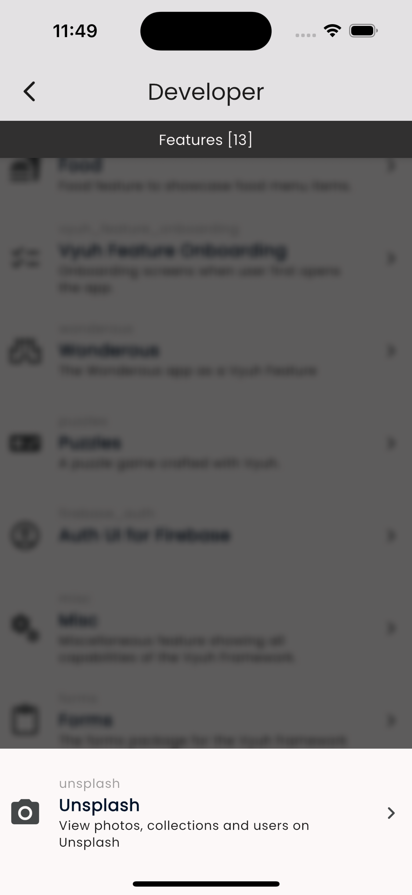

# Thinking in Blocks

Vyuh is an innovative framework designed to revolutionize the way developers build Flutter applications. Unlike traditional methods, Vyuh focuses on a content-based approach that leverages the power of modularity and a dynamic Content Management System (CMS). This framework leverages the power of _**blocks**_ enabling developers to create highly flexible and maintainable applications by decomposing them into distinct features and content blocks.

## Traditional method

**Traditional Flutter Development Approach**

In a traditional Flutter development approach, applications are often built in a monolithic fashion. This means:

1. **Monolithic Structure**: The entire application is typically a single codebase where features and content are tightly coupled.
2. **Hard-Coded Journeys**: User journeys and interfaces are hard-coded, requiring code changes for updates or modifications.
3. **Limited Modularity**: While Flutter encourages some level of component reuse, the overall structure remains monolithic, making it difficult to isolate and update individual features or content on the fly.
4. **Static Content**: Content is usually static and embedded directly into the app, leading to frequent code updates and redeployments. This delays the time to market of a feature to the customer.
5. **Team Co-ordination**: Requires high amount of co-ordination between teams to ensure no one is impacting the overall codebase or stepping on each other.

<figure><figcaption>
Fixed journeys and screen content
</figcaption></figure>

## Vyuh's Approach

**Vyuh's Content-based Approach**

Vyuh shifts the paradigm from a monolithic development approach to a more modular, feature-based, content-block driven approach. Here's how:

1. **Feature-Based**: Vyuh promotes the decomposition of applications into independent, reusable and transferable features. Each feature represents a logical unit of customer-facing functionality.
2. **Dynamic Content Control**: Instead of hard-coding user journeys and screen-content, Vyuh allows these to be managed dynamically via an external CMS. This enables real-time updates and modifications without requiring app redeployment.
3. **Enhanced Modularity**: By breaking down the app into smaller, manageable features, Vyuh enhances modularity. Each feature can be developed, tested, and updated independently.
4. **Separation of Concerns**: This approach enforces a clear separation between the app's structure and its content, leading to cleaner, more maintainable codebases. The presentation is controlled from Flutter, driven by the content coming from a cloud-hosted headless CMS.
5. **Team Independence**: Since features can be developed and even tested independently, it reduces the co-ordination between teams and allows them to operate at full speed.

<figure><figcaption>
Content driven workflow in a Vyuh based Application
</figcaption></figure>

## **Comparing the Approaches**

<table><thead><tr><th>Aspect</th><th width="235.66666666666663">Traditional Flutter Development</th><th>Vyuh Framework</th></tr></thead><tbody><tr><td><strong>Structure</strong></td><td><strong>Monolithic</strong></td><td><strong>Modular</strong> (Feature-Based)</td></tr><tr><td><strong>Content Management</strong></td><td><strong>Static</strong>, hard-coded within the app</td><td><strong>Dynamic</strong>, managed via external CMS with Content Blocks</td></tr><tr><td><strong>User Journeys</strong></td><td><strong>Fixed</strong>, hard-coded in the app</td><td><strong>Dynamic</strong>, controlled through CMS</td></tr><tr><td><strong>Modularity</strong></td><td><strong>Limited</strong>, requires deliberate effort to split into packages</td><td><strong>High</strong>, enhanced through reusable blocks</td></tr><tr><td><strong>Flexibility</strong></td><td><strong>Low</strong>, requires redeployment for updates</td><td><strong>High</strong>, real-time updates through CMS</td></tr><tr><td><strong>Explorative Power</strong></td><td><strong>Low</strong>, requires code changes to try different variations</td><td><strong>High</strong>, make real-time changes and switch variants with live preview</td></tr><tr><td><strong>Team Co-ordination</strong></td><td><strong>High</strong>, to ensure minimal impact of changes</td><td><strong>Low</strong>, since development happens independently</td></tr></tbody></table>

## **Mindset for Building Vyuh Apps**

Building applications with Vyuh requires a shift in mindset from traditional development practices. Developers need to think in terms of independent content blocks rather than a single, cohesive codebase. Here are key points to adopt this mindset:

* **Modular Design**: Think of your application as a set of independent features (aka mini-apps). Every feature should only expose Content-blocks (aka Components) and avoid having pre-defined journeys.
* **Dynamic Content Management**: Embrace the flexibility offered by the CMS. Plan for dynamic content updates and user journey modifications. Design blocks to be adaptable to changes from the CMS without requiring code changes.
* **Separation of Concerns**: Maintain a clear separation between the application’s content and its presentation. Treat the CMS as the primary source of truth for content and user journeys. Leverage a Design System to create the Flutter equivalents of the content coming from the CMS.
* **Configuration vs Implementation**: Design the content schemas with the principles of _structured-content_ without muddying it with presentation or implementation details. CMS is purely for business-level configuration. The nitty-gritty details of implementation and presentation must be kept on the Flutter side.
* **Reusability**: Design blocks with reusability in mind. Aim to create blocks that can be reused across different parts of the application or even in different applications.

<figure><figcaption>
Features and Plugins as the two primary building blocks
</figcaption></figure>

## Summary

By moving away from monolithic structures and embracing feature-based blocks, developers can build more flexible, maintainable, and scalable applications. The dynamic control over user journeys and content through a CMS further enhances the capabilities of Flutter apps, making Vyuh a powerful framework for modern app development.
